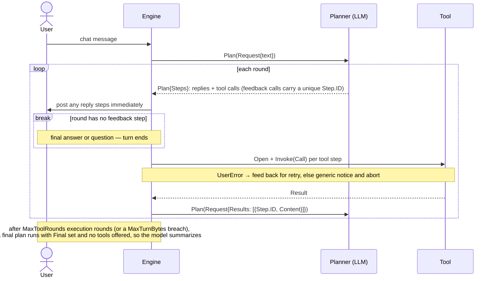

# Developing chatops

This guide describes the internal packages and how to add credential stores, chat backends, tools, and planners. For installation, configuration, and command usage, see the [user guide](README.md).

## Engine (`engine`)

The `engine` package joins the component interfaces into the server loop. It receives messages from one `chat.Conn` and drives an **agentic loop** for each: it asks the `planner.Planner` for a plan, executes the steps, feeds the results of feedback steps back to the planner, and re-plans — until a round produces no feedback step. Reply steps and fire-and-post tool results are posted to the originating conversation as they occur. A planner asks for clarification or confirmation by returning a `reply://` step, so multi-message interaction state stays in the planner instead of the engine.

End to end, one chat request flows through the components like this:



Each round the engine handles a plan's steps by kind: a **reply** step posts to chat immediately; a **feedback** tool step (`Step.Feedback` true) has its result collected — rendered to a canonical, byte-bounded `StepResult.Content` — and fed back to the planner rather than posted; a **fire-and-post** tool step (the zero value) has its `Result.Text` posted directly, the single-shot behavior that keeps fixed planners such as `ping` unchanged. A round with no feedback step ends the turn. This is what lets the model interpret tool output — filter, compute over, summarize — for any tool, keeping the tool a faithful reader (see [Tools](#tools-tool)) and the interpretation in the planner; `output=json` on a tool such as `k8s-list` gives that loop structured data to reason over.

The loop is bounded. `Config.MaxToolRounds` caps tool-execution rounds, and `Config.MaxResultBytes`/`Config.MaxTurnBytes` cap fed-back content; on the last permitted round, or a per-turn byte breach, the engine makes one final planning call with `Request.Final` set so the planner summarizes with no further tools offered. A feedback step's `tool.UserError` is fed back so the model can correct itself (bounded by the round cap); any other tool error is fatal to the turn. When a turn ends — normally or on an abort — the engine calls `EndTurn` on a planner that implements `planner.TurnCloser`, so it can drop the in-flight transcript. Because the transcript is keyed by `(ConnectionID, ConversationID)` with no turn id, the loop relies on the scheduler admitting one message per conversation at a time.

```go
e, err := engine.New(engine.Config{
    ConnectionID: "operations",
    Chat:         conn,
    Planner:      p,
    Tools:        tools,
    Credentials:  credentials,
})
if err != nil {
    // handle error
}
if err := e.Run(ctx); err != nil {
    // handle processing or cleanup error
}
```

`Run` preserves message order within each conversation while processing independent conversations concurrently through a fixed-size worker pool. The pool and its bounded backlog prevent messages from creating unbounded worker goroutines; `Config.MaxConcurrency` controls the worker count and defaults to `engine.DefaultMaxConcurrency`. The engine fails fast only on fatal outcomes: connection loss and shutdown stop `Run` and return the error to the caller. A single message's failure — a bad plan, a failing tool, even a panicking one — must not stop a long-running bot, so it is recovered at the message boundary, logged in full, and turned into a chat notice to the requester while the engine keeps serving. Context cancellation and a connection deliberately closed through `chat.Conn.Close` are graceful outcomes. A remote disconnect such as telnet EOF is a connection failure and is returned, allowing the caller or service supervisor to decide whether to reconnect or restart.

The engine owns and closes the chat connection and planner after `New` succeeds, while the caller retains ownership of the credential store. It intentionally opens and closes each operational tool around one plan step, favoring isolated ownership and simple cleanup over engine-level instance reuse. A backend with expensive setup should implement safe pooling behind its opener rather than relying on the engine to retain stateful tool instances. Reply steps are different: the engine binds their destination to the originating conversation and accepts only the canonical `reply.URL`, preventing planner output from redirecting a reply or silently attaching unsupported URL configuration.

## Credential store (`cred`)

The `cred` package provides a generic way to access credentials from pluggable backends. The top-level package defines the interface; each backend lives in its own sub-package and exports the URL scheme it serves plus an opener, which callers wire into a registry (no `init()` side effects — supported backends are always visible at the wiring site):

```go
type Store interface {
    // Get retrieves the credential identified by the predefined key. It returns an
    // error wrapping cred.ErrNotFound when the key does not exist.
    Get(ctx context.Context, key cred.Key) (string, error)

    // Close releases any resources held by the store.
    Close() error
}
```

A store is identified by a single URL — the scheme selects the backend and the rest of the URL locates the store. Credentials for accessing the store itself are **never** part of the URL; each backend takes them from its standard environment variables (for example `AWS_ACCESS_KEY_ID`/`AWS_SECRET_ACCESS_KEY`, `VAULT_TOKEN`), resolved through the backend SDK's default configuration chain.

Available backends:

| Scheme      | Sub-package     | Store URL                        |
| ----------- | --------------- | -------------------------------- |
| `json-file` | `cred/jsonfile` | `json-file:///path/to/file.json` |

`cred.Key` is a closed set of application credential identifiers: `cred.SlackBotToken`, `cred.SlackAppToken`, and `cred.PlannerAPIKey`. Store backends map those identifiers to their native layout, preventing callers from constructing arbitrary names or configurable prefixes.

### Usage

Build a registry from the backends you want, open the store by URL, then retrieve credentials by key:

```go
import (
    "context"
    "errors"

    "github.com/hangxie/chatops/cred"
    "github.com/hangxie/chatops/cred/jsonfile"
)

reg := cred.NewRegistry(
    cred.Backend{Scheme: jsonfile.Scheme, Opener: jsonfile.Opener},
)
store, err := reg.Open(context.Background(), "json-file:///etc/chatops/creds.json")
if err != nil {
    // handle error
}
defer store.Close()

secret, err := store.Get(context.Background(), cred.PlannerAPIKey)
if errors.Is(err, cred.ErrNotFound) {
    // credential does not exist
}
```

Backends also expose a typed `Open` function for direct use, e.g. `jsonfile.Open(ctx, "/etc/chatops/creds.json")`.

### json-file backend

The store URL is the file path (relative paths work too: `json-file://relative/path.json`, and a leading `~` expands to the home directory: `json-file://~/creds.json`). The file uses a strict schema whose sections and credentials are optional:

```json
{
  "slack": {
    "bot-token": "xoxb-...",
    "app-token": "xapp-..."
  },
  "planner": {
    "api-key": "sk-..."
  }
}
```

Unknown sections, unknown fields, nulls, and non-string values are rejected by `Open`. Missing credentials remain absent and cause `Get` to wrap `cred.ErrNotFound`; present empty strings are returned so the consuming component can report that its required credential is empty.

### Adding a new backend

1. Create a sub-package under `cred/` named after the backend (e.g. `cred/vault`).
2. Define a `Store` type implementing the `cred.Store` interface:
   - `Get` returns the credential for a key, wrapping `cred.ErrNotFound` (with `%w`) when the key does not exist so callers can detect it with `errors.Is`.
   - `Close` releases connections or other resources.
3. Provide an `Open` function taking `context.Context` plus backend-specific location parameters and returning `(*Store, error)`. Take credentials for the store from the backend's standard environment variables (prefer the official SDK's default configuration chain); never accept them as parameters.
4. Export the scheme and an opener so callers can wire the backend into a `cred.Registry` (backends never self-register via `init()`):

   ```go
   // Scheme is the URL scheme this backend serves in a cred.Registry.
   const Scheme = "my-backend"

   // Opener is the cred.OpenerFunc for this backend.
   func Opener(ctx context.Context, u *url.URL) (cred.Store, error) {
       return Open(ctx, u.Host+u.Path)
   }
   ```

5. Add a test file with table-driven tests covering `Open` failures, existing keys, missing keys, context cancellation, and opening through a `cred.Registry` with the exported scheme.
6. List the backend in the table above and document its store layout in a section like the json-file one.

Adding a new application credential requires adding its identifier and section/field path to the schema table in `cred/cred.go`. `Key.String` and schema-aware store backends derive their mappings from that table.

## Chat backends (`chat`)

The `chat` package provides a generic way for the bot to talk to chat backends (Slack, Discord, Mattermost, a naive telnet chat, ...). The top-level package defines the interface; each backend lives in its own sub-package and exports the URL scheme it serves plus an opener, which callers wire into a registry (no `init()` side effects — supported backends are always visible at the wiring site):

```go
type Conn interface {
    // Receive returns the next inbound message. It blocks until a
    // message arrives, ctx is done, the connection is lost, or Close
    // is called. After Close it reports an error wrapping ErrClosed.
    Receive(ctx context.Context) (Message, error)

    // Send posts msg.Text into the conversation identified by
    // msg.ConversationID. It returns an error wrapping
    // ErrUnknownConversation when the ID does not map to a
    // conversation the backend knows.
    Send(ctx context.Context, msg Message) error

    // Close terminates the connection, unblocking any pending Receive.
    Close() error
}
```

Messages are grouped into **conversations** — the topic or thread a piece of work is about. Each backend computes a stable conversation ID from its native addressing (e.g. a Slack backend derives it from channel and thread; telnet has a single conversation) and translates it back on send. Callers treat `Message.ConversationID` as an opaque string scoped to one `Conn`: to reply, send with the `ConversationID` of the message being answered.

A connection is identified by a single URL — the scheme selects the backend and the rest of the URL locates the server. Credential values are **never** part of the URL; backends resolve predefined `cred.Key` identifiers from the `cred.Store` passed to `Registry.Open`. A backend that needs no credentials ignores the store.

Available backends:

| Scheme   | Sub-package   | Connection URL       |
| -------- | ------------- | -------------------- |
| `slack`  | `chat/slack`  | `slack://`            |
| `telnet` | `chat/telnet` | `telnet://host:port` |

### Usage

Build a registry from the backends you want, open the connection by URL, then receive and reply:

```go
import (
    "context"

    "github.com/hangxie/chatops/chat"
    "github.com/hangxie/chatops/chat/telnet"
)

reg := chat.NewRegistry(
    chat.Backend{Scheme: telnet.Scheme, Opener: telnet.Opener},
)
conn, err := reg.Open(context.Background(), "telnet://chat.example.com:6023", credentials)
if err != nil {
    // handle error
}
defer conn.Close()

for {
    msg, err := conn.Receive(context.Background())
    if err != nil {
        break // connection closed or lost
    }
    reply := chat.Message{ConversationID: msg.ConversationID, Text: "on it"}
    if err := conn.Send(context.Background(), reply); err != nil {
        // handle error
    }
}
```

Backends also expose a typed `Open` function for direct use, e.g. `telnet.Open(ctx, "chat.example.com:6023")`.

### Slack backend

The Slack backend uses the Events API and interactive payloads over Socket Mode for inbound messages, `chat.postMessage` for outbound replies, and `chat.update` to remove consumed controls. Its `slack://` URL takes no host, path, or query configuration. It resolves the bot OAuth token from `cred.SlackBotToken` (`slack.bot-token`) and the app-level token with `connections:write` from `cred.SlackAppToken` (`slack.app-token`); see the user guide for the required app event subscriptions and bot scopes. Startup calls `auth.test` to validate the bot token and obtain its user ID before opening Socket Mode.

Every accepted Socket Mode envelope is acknowledged before its event is processed. Human message and `app_mention` events become `chat.Message` values only when their text starts with the exact `<@USERID>` obtained for the authenticated bot. The backend strips that stable bot identity before planning, so changing the bot's display name requires no ChatOps configuration. Mentions of other users, bot mentions later in the text, unmentioned messages, bot messages, message subtypes, events without a sender, and empty commands are ignored. The conversation ID combines the Slack channel ID with the root message timestamp. A root message and all replies in its thread therefore share one engine conversation, and `Send` posts back into that thread. Routing entries refresh on receive and send, expire after 24 hours of inactivity, and are limited to 4,096 entries. An indexed min-heap makes refresh, expiry, and capacity eviction O(log n); reaching capacity evicts the earliest-expiring route.

`chat.Message.Choices` carries optional label/value responses. The reply tool maps choices supplied on `tool.Call` into that backend-neutral field. Slack renders them as Block Kit buttons and treats a click as an ordinary inbound message containing the selected value; telnet ignores the metadata and sends the message's fallback text. Slack accepts only values registered for a prompt message posted by this process. Prompt routes expire after ten minutes, are capped at 4,096 entries, and are atomically removed on selection, which rejects expired, foreign, unregistered, and duplicate clicks without unbounded state. A valid click clears the message's buttons before delivery to the planner.

### telnet backend

The connection URL is the server address; the port defaults to the telnet port 23 (`telnet://chat.example.com` ≡ `telnet://chat.example.com:23`). The wire protocol is bare lines of text: every newline-terminated line received is one inbound message (blank lines are ignored), and `Send` writes the message text followed by a newline. Telnet option negotiation (IAC sequences) is not performed.

The connection carries a single conversation whose ID is the `telnet.ConversationID` constant; the protocol has no notion of identity, so `Message.Sender` is empty.

### Adding a new backend

1. Create a sub-package under `chat/` named after the backend (e.g. `chat/slack`).
2. Define a `Conn` type implementing the `chat.Conn` interface:
   - Compute `Message.ConversationID` on receive from the backend's native addressing (e.g. Slack channel + thread), and translate it back on send. Wrap `chat.ErrUnknownConversation` (with `%w`) when a sent ID does not map to a conversation.
   - After `Close`, `Receive` and `Send` report an error wrapping `chat.ErrClosed`; `Close` must also unblock a pending `Receive`.
3. Provide an `Open` function taking `context.Context`, a `cred.Store`, and any backend-specific location parameters, and returning `(*Conn, error)`. Resolve credential values using predefined `cred.Key` identifiers; never accept values as URL elements.
4. Export the scheme and an opener so callers can wire the backend into a `chat.Registry` (backends never self-register via `init()`), and add it to the CLI's shared registry wiring in `internal/registry` (used by both `cmd/server` and `cmd/chats`):

   ```go
   // Scheme is the URL scheme this backend serves in a chat.Registry.
   const Scheme = "my-backend"

   // Opener is the chat.OpenerFunc for this backend.
   func Opener(ctx context.Context, u *url.URL, creds cred.Store) (chat.Conn, error) {
       return Open(ctx, creds, u.Host)
   }
   ```

5. Add a test file with table-driven tests covering `Open` failures, receive/send round-trips, conversation ID mapping, context cancellation, `Close` semantics, and opening through a `chat.Registry` with the exported scheme.
6. List the backend in the table above and document its protocol and conversation ID scheme in a section like the telnet one.

## Tools (`tool`)

The `tool` package provides a generic way to invoke operational tools (kubernetes, proxmox, harbor, a dummy ping tool, ...). The top-level package defines the interface; each tool lives in its own sub-package and exports the URL scheme it serves plus an opener, which callers wire into a registry (no `init()` side effects — supported tools are always visible at the wiring site):

```go
type Tool interface {
    // Invoke performs the tool's operation with the arguments in call and
    // returns its outcome. It returns an error when the arguments are
    // invalid or the operation fails.
    Invoke(ctx context.Context, call Call) (Result, error)

    // Close releases any resources held by the tool.
    Close() error
}
```

Each tool performs a single intent, so a call names no verb — the tool *is* the intent. A call carries only a flat bag of **arguments** (e.g. `service`: `github`), keyed by the parameter names the tool declares in its descriptor; this mirrors the Model Context Protocol, where each tool has a name and a flat input schema and a call supplies only arguments. The result carries **text** — the human-readable outcome, composed by the tool and ready to post to chat as-is — plus optional machine-readable key-value **details**; callers never need the details to render a reply. Text is empty only when the tool has already delivered the outcome to the human itself (like the reply tool, whose intent is posting into chat), so callers relay non-empty text and stay silent on empty text.

A tool instance is identified by a single URL — the scheme selects the implementation, host/port/path locate the endpoint it operates on, and query parameters carry further non-secret instance configuration. Credential *values* are **never** part of the URL; tools resolve predefined `cred.Key` identifiers from the `cred.Store` passed to `Open`. Adding a credential-bearing tool therefore extends the application credential schema rather than accepting caller-selected key prefixes.

**A tool is a faithful reader/actor, not an interpreter.** Keep open-ended, fuzzy, or computed selection out of the tool and let the planner (an LLM) do that work. Chat requests routinely ask for judgments a fixed argument cannot express — "pods that restarted recently", "under-replicated deployments", "the noisy services" — where "recently", "under-replicated", and "noisy" are the model's job, not the tool's. So resist growing a query/filter/projection mini-language inside a tool; you would reimplement the model's strength and still not cover the next phrasing. Instead give the tool a **structured output mode** (e.g. `output=json`/`yaml`, as the k8s tools do) that hands the planner enough raw data to filter, project, and summarize itself. Reserve first-class arguments and computed output columns for the *common, well-defined* cases (readiness, restart counts, replica gaps), and treat structured output as the escape hatch for everything else. The one exception is filtering the underlying system already does exactly and cheaply — a Kubernetes label or field selector, a paging token — which stays a tool argument because it is precise server-side selection, not interpretation. This keeps tools small and composable and puts natural-language judgment where the model already excels.

Available tools:

| Scheme  | Sub-package   | Tool URL                        |
| ------- | ------------- | ------------------------------- |
| `ping`  | `tool/ping`   | `ping://`                       |
| `status-check` | `tool/status` | `status-check://`        |
| `status-list` | `tool/status` | `status-list://`          |
| `k8s-list` | `tool/k8s`  | `k8s-list://`                 |
| `k8s-get`  | `tool/k8s`  | `k8s-get://`                  |
| `reply` | `tool/reply`  | `reply://` (no registry opener) |

### Usage

Build a registry from the tools you want, open the tool by URL with a credential store, then invoke it:

```go
import (
    "context"
    "fmt"

    "github.com/hangxie/chatops/tool"
    "github.com/hangxie/chatops/tool/ping"
)

reg := tool.NewRegistry(
    tool.Backend{Scheme: ping.Scheme, Opener: ping.Opener, Descriptor: &ping.Descriptor},
)
tl, err := reg.Open(context.Background(), "ping://", nil) // creds not needed by ping
if err != nil {
    // handle error
}
defer tl.Close()

result, err := tl.Invoke(context.Background(), tool.Call{})
if err != nil {
    // handle error
}
fmt.Println(result.Text) // "pong"
```

Tools also expose a typed `Open` function for direct use, e.g. `ping.Open(ctx)`.

### ping tool

A dummy tool that always answers `pong`, useful as a liveness check and as the reference implementation of the interface. It has no endpoint and takes no credentials, so the URL is a bare `ping://` (anything beyond the scheme — host, path, query, userinfo, or non-empty fragment — is rejected; a bare trailing `#` parses identically to the bare URL and is accepted). The tool takes no arguments; `Call.Arguments` is ignored. It exports a `tool.Descriptor` as a reference for the typed-schema wiring.

### status tools

The service-status tools check public third-party status APIs and normalize their different schemas. They have no credentials or caller-configurable endpoint, so their only URLs are the bare `status-check://` and `status-list://`; keeping upstream URLs in the compiled provider catalog prevents planner output from turning the tools into an arbitrary HTTP client.

`status-check://` requires one canonical provider or alias in `Call.Arguments["service"]`. The canonical providers are `github`, `anthropic`, `cloudflare`, `openai`, `gemini`, `slack`, and `docker-hub`; the special service `all` checks every canonical provider. `status-list://` takes no arguments and returns the canonical provider names. See the user guide for the complete alias table. Each tool exports a `tool.Descriptor` (the check tool declaring its required `service` argument), so an LLM planner is offered `status-check` and `status-list` as separate typed functions rather than guessing a verb.

Providers use adapters for their public status platform: GitHub, Anthropic, Cloudflare, and OpenAI use the common Statuspage summary schema; Slack uses the Slack Status API; Gemini combines active incidents for the stable Vertex Gemini and Workspace Gemini product IDs from Google's public JSON feeds; and Docker Hub uses the Status.io public API. Health is normalized to `operational`, `maintenance`, `degraded`, `partial_outage`, `major_outage`, or `unknown`.

The checker preserves catalog order and limits aggregate checks to four concurrent provider requests. Network failures, non-success HTTP responses, and malformed upstream data become `unknown` snapshots so a status-page outage does not trigger the engine's fail-fast path; invalid tool calls and context cancellation are still returned as errors. Response bodies are bounded, and the shared HTTP client applies a five-second timeout.

When adding a provider, prefer an existing adapter and add aliases only when they are unambiguous. Public catalogs such as [awesome-status-pages](https://github.com/ivbeg/awesome-status-pages) can help identify candidates, but they are discovery aids rather than runtime dependencies: verify the provider's official page, machine-readable endpoint, response format, and continued availability before adding it to the compiled catalog. Add a new adapter only when no existing status platform schema fits, and cover its health mapping, incidents, malformed responses, and cancellation behavior with table-driven tests.

### k8s tools

Two single-intent tools in the `tool/k8s` sub-package read Kubernetes resources for chat: `k8s-list` lists a resource type in a namespace or across all namespaces, and `k8s-get` fetches specific resources by name. Both resolve the resource type through the API server's discovery data and read objects with the dynamic client, so a single implementation serves built-in resources and CustomResourceDefinitions alike; the `kind` argument accepts a plural, singular, short name, or kind.

These tools are the exception to the credential model: cluster access comes from a kubeconfig (the standard `KUBECONFIG`/`~/.kube/config` rules) or the in-cluster service account, not from the `cred.Store`, so both openers ignore the store they are passed. The URL carries no host and no credentials — only which cluster to select, via `?context=` or `?kubeconfig=` — and a stray host is rejected to catch a kubeconfig path or context placed there by mistake. Configuring `KUBECONFIG` once therefore serves every k8s tool.

`k8s-list` reads `kind` (required), `namespace` (optional), `all-namespaces` (optional boolean), and `output` (optional: `table`, `json`, or `yaml`). The default `table` renders an aligned table whose value columns are chosen per kind — `READY STATUS RESTARTS` for pods, `READY UP-TO-DATE AVAILABLE` for deployments, and a single `STATUS` column otherwise — with a column dropped when it is empty for every listed item, so the table stays compact for arbitrary CRDs. The status column reads `status.phase` and falls back to `status.health.status`, so CRDs such as Argo CD Applications report health without a bespoke column. Per-kind columns and the status fallback live in `tool/k8s/columns.go`; a new workload's columns are added by extending `valueColumns`. `json` and `yaml` emit the full manifests of every listed item, the escape hatch for a planner that needs to filter or project on fields the table does not surface.

`k8s-get` reads `kind` (required), `name` (required, comma-separated for several at once), `namespace` (optional), and `output` (optional: `brief`, `json`, or `yaml`). The default `brief` is a describe-style summary — identity, age, labels, a status hint, and recent events — so no separate describe verb is needed.

Secret values are masked before rendering in every output format, on both tools: the `brief` summary omits a Secret's data, `json`/`yaml`/`table` keep the shape but replace each value, and the `kubectl.kubernetes.io/last-applied-configuration` annotation (which can round-trip the original values) is stripped from Secrets. See `tool/k8s/redact.go`.

### reply tool

A tool that posts text back into a chat conversation, so a planner (see below) can express "say this to the requester" as an ordinary tool step alongside operational tool calls. Unlike other tools it is bound to a live `chat.Conn` — the connection the message being answered arrived on — rather than to an endpoint of its own, so it has **no `Opener`** and cannot be opened through a `tool.Registry`. Callers open it directly and make it available to plan execution under the conventional bare URL exported as `reply.URL` (`reply://`):

```go
import "github.com/hangxie/chatops/tool/reply"

rt, err := reply.Open(ctx, conn) // conn is the chat.Conn messages arrive on
```

The reply tool reads `Arguments["text"]` for the text to post and `Arguments["conversation"]` for the conversation ID to post into (the `ConversationID` of the message being answered). The conversation is injected by the executor, not the model: planners leave it unset and the engine sets it to the conversation the request arrived on. Sending is the whole outcome, so `Result.Text` stays empty — callers that post non-empty `Result.Text` back to chat will not double-post. The tool never closes the connection; that stays with the caller.

### Adding a new tool

Each tool performs a single intent. A tool that would otherwise offer several verbs is split into one sub-package exposing one scheme, opener, and descriptor per intent (as `tool/status` does with `status-check` and `status-list`).

1. Create a sub-package under `tool/` named after the tool (e.g. `tool/kubernetes`).
2. Define a `Tool` type implementing the `tool.Tool` interface:
   - `Invoke` reads the arguments it needs from `Call.Arguments` and maps them onto the tool's API, returning an error when a required argument is missing or invalid. For an actionable failure whose message is safe to show a human — an unknown resource type, a not-found object, a permission denial — return a `tool.UserError` (`tool.NewUserError`/`tool.WrapUserError`): the engine surfaces its message to chat and, in the agentic loop, feeds it back so the model can correct itself, whereas a plain `error` is treated as internal and yields only a generic notice.
   - Compose `Result.Text` as the complete human-readable answer; put supplementary machine-readable output in `Result.Details`. In the agentic loop the engine renders `Result` to a canonical string (Text, then sorted `Details`) when feeding it back to the planner.
   - Keep interpretation out of the tool (see "a faithful reader/actor" above): expose exact server-side filters as arguments, offer a structured `output` mode for anything open-ended, and leave fuzzy or computed selection to the planner rather than building a filter language.
   - `Close` releases connections or other resources.
3. Provide an `Open` function taking `context.Context` plus tool-specific parameters and returning `(*Tool, error)`. Resolve credentials from the `cred.Store` using predefined `cred.Key` identifiers; never accept credential values as parameters or URL elements.
4. Export the scheme and an opener so callers can wire the tool into a `tool.Registry` (tools never self-register via `init()`):

   ```go
   // Scheme is the URL scheme this tool serves in a tool.Registry.
   const Scheme = "my-tool"

   // Opener is the tool.OpenerFunc for this tool.
   func Opener(ctx context.Context, u *url.URL, creds cred.Store) (tool.Tool, error) {
       return Open(ctx, u.Host, creds)
   }
   ```

5. Export a `tool.Descriptor` describing the tool and wire it into the `Backend` alongside the scheme and opener — it is required, so `NewRegistry` panics on a backend without one. The descriptor lets an LLM planner offer the tool as its own typed function (named for the scheme, with a flat input schema of its typed arguments and their required fields) instead of making the model guess the vocabulary. Keep the described arguments in step with `Invoke`.

   ```go
   // Descriptor is the tool's self-description for planners.
   var Descriptor = tool.Descriptor{
       Description: "One-line, model-facing description of the tool.",
       Parameters: []tool.Param{
           {Name: "deployment", Type: "string", Required: true, Description: "the deployment to restart"},
       },
   }
   ```

   ```go
   tool.Backend{Scheme: mytool.Scheme, Opener: mytool.Opener, Descriptor: &mytool.Descriptor}
   ```

6. Add a test file with table-driven tests covering `Open` failures, valid and invalid arguments, context cancellation, `Close` semantics, opening through a `tool.Registry` with the exported scheme, and that the descriptor validates.
7. List the tool in the table above and document its arguments and credential identifiers in a section like the ping one.

## Planners (`planner`)

The `planner` package provides a generic way to turn free-form chat messages into executable plans, backed by pluggable planner backends — the OpenAI Chat Completions backend (which also drives compatible services such as Gemini and Ollama), Anthropic (planned), or the dummy ping planner. The top-level package defines the interface; each backend lives in its own sub-package and exports the URL scheme it serves plus an opener, which callers wire into a registry (no `init()` side effects — supported backends are always visible at the wiring site):

```go
type Planner interface {
    // Plan decides what to do about one round of a turn and returns the
    // steps to execute. On a human turn req carries the message text; on a
    // continuation it carries the previous round's tool Results; on the
    // final round req.Final asks for a terminal, tool-free summary. Asking
    // the requester a clarifying question is expressed as a step invoking
    // the reply tool, not as an error.
    Plan(ctx context.Context, req Request) (Plan, error)

    // Close releases any resources held by the planner.
    Close() error
}
```

A stateful planner may also implement the optional `TurnCloser` interface (`EndTurn(connectionID, conversationID string)`): the engine calls it when a turn ends — normally or on an abort — so the planner can drop the in-flight transcript it kept for that turn. It takes no context because it must run even on an already-canceled abort path. A fixed planner that keeps no per-turn state need not implement it.

A request carries the message **text**, the **conversation ID** and **sender** (both as computed by the chat backend, see `chat.Message`), and a caller-assigned **connection ID**; planners use the connection and conversation IDs together to keep per-conversation context across requests. The connection ID exists because conversation IDs are only unique within one `chat.Conn` (every telnet connection reports the same one, for example): a caller serving several connections from one planner must give each connection a distinct opaque ID, while a caller with a single connection may leave it empty. The returned plan is a sequence of **steps**, each naming a tool by the URL it is opened from (see the `tool` package) plus the `tool.Call` to invoke on it. Replying to the requester is itself a step — one invoking the `reply://` tool — so a clarifying question and an operational action have the same shape, mirroring how LLM tool-use APIs treat text output and tool calls as peers in one turn.

Across the agentic loop a request also carries **results** — the outcomes of the previous round's feedback steps, each correlated by `Step.ID` and rendered to a bounded `StepResult.Content` — and a **final** flag the engine sets on the forced summarizing round. A step declares its disposition with **feedback**: a feedback step's result is fed back to the planner for the next round and the step carries a unique **id**, while a fire-and-post step (the zero value, as a fixed planner such as `ping` emits) has its `Result.Text` posted to chat. A reply step that came from a provider tool call also carries an id, so an LLM backend can keep a valid provider transcript across rounds.

Steps name tools by URL only, so a plan is **not self-contained**: the caller executes it in the context of the request that produced it. In particular, `reply://` resolves to the reply tool bound to the chat connection that request arrived on — a caller serving several connections keeps one reply tool per connection rather than sharing one — which is what keeps replies on the right connection even when conversation IDs collide across connections.

A planner is identified by a single URL — the scheme selects the backend, host/port/path locate the endpoint it talks to (empty for providers with a well-known API endpoint), and query parameters carry further configuration such as the model (e.g. `openai-chat-completions://api.openai.com/v1?model=gpt-5`, `anthropic://?model=claude-fable-5`). Credential *values* are **never** part of the URL. Because the server runs one planner, an authenticated backend resolves the single `cred.PlannerAPIKey`; caller-selected credential prefixes are not supported.

`Open` also receives the caller's enabled tool set (the `*tool.Registry` built from `--tool`), so an LLM-backed backend can offer those tools to the model as callable functions and emit plan steps naming them by scheme. A backend that plans a fixed set of steps (such as `ping`) ignores it. Backend `OpenerFunc` implementations take the trailing `tools *tool.Registry` parameter (never nil, possibly empty) and ignore it unless they offer tools to a model.

Available backends:

| Scheme                     | Sub-package                       | Planner URL                                         |
| -------------------------- | --------------------------------- | --------------------------------------------------- |
| `openai-chat-completions`  | `planner/openaichatcompletions`   | `openai-chat-completions://host[:port][/path]?model=NAME` |
| `ping`                     | `planner/ping`                    | `ping://`                                           |

### Usage

Build a registry from the backends you want, open the planner by URL with a credential store and the enabled tool set, then plan inbound messages and execute the steps:

```go
import (
    "context"

    "github.com/hangxie/chatops/planner"
    planneropenaichat "github.com/hangxie/chatops/planner/openaichatcompletions"
    "github.com/hangxie/chatops/planner/ping"
)

reg := planner.NewRegistry(
    planner.Backend{Scheme: planneropenaichat.Scheme, Opener: planneropenaichat.Opener},
    planner.Backend{Scheme: ping.Scheme, Opener: ping.Opener},
)
// tools is the enabled *tool.Registry; nil is treated as the empty set.
// creds and tools are passed through to the backend's opener.
p, err := reg.Open(context.Background(), "ping://", nil, tools)
if err != nil {
    // handle error
}
defer p.Close()

plan, err := p.Plan(context.Background(), planner.Request{
    Text:           msg.Text,
    ConversationID: msg.ConversationID,
    Sender:         msg.Sender,
})
if err != nil {
    // handle error
}
for _, step := range plan.Steps {
    // resolve step.Tool ("ping://", "reply://", ...) to an opened
    // tool.Tool — "reply://" to the reply tool bound to the
    // connection msg arrived on — invoke step.Call on it, and post
    // any non-empty Result.Text back into the conversation
}
```

Backends also expose a typed `Open` function for direct use, e.g. `ping.Open(ctx)`.

### ping planner

A dummy planner that recognizes only the ping intent, useful as a wiring check and as the reference implementation of the interface. It talks to no LLM endpoint and takes no credentials, so the URL is a bare `ping://` (anything beyond the scheme is rejected, same rules as the ping tool).

- A message that is exactly `ping` (ignoring case and surrounding whitespace) plans an invocation of the ping tool.
- A message that merely contains `ping` as a standalone word (so `can you ping the box?` counts, `pinging` or `shipping` do not) plans a reply asking `do you want me to ping? (yes/no)` with Yes and No choices and remembers the pending question for that conversation.
- The next message in that conversation answers it: `yes`/`y` plans the ping, `no`/`n` plans an acknowledging reply, and anything else drops the pending confirmation without pinging and is handled as a fresh message. Each conversation — scoped by connection and conversation ID, so the same conversation ID on another chat connection cannot answer the question — holds at most one pending confirmation (a repeated ask just renews it), and conversations do not affect each other.
- Pending confirmations are bounded state: an unanswered confirmation expires after ten minutes, and at most 1024 conversations' confirmations are remembered at once (asking past the cap evicts the oldest).
- Everything unrecognized plans a reply saying `sorry, I don't understand`.

### openai-chat-completions planner

A planner backed by any service that speaks the OpenAI Chat Completions API, so the same backend drives OpenAI, Google Gemini's OpenAI-compatible endpoint, a local Ollama, vLLM, LocalAI, and similar servers. The endpoint is configured through the URL: the host is required (the planner is not tied to a fixed provider) and locates the endpoint, whose path defaults to `/v1`, with `insecure=true` selecting plain HTTP. The `model` query parameter is required (there is no universal default across services). By default the backend requires `cred.PlannerAPIKey` (`planner.api-key`) and sends it as a bearer token. `keyless=true` explicitly selects an unauthenticated endpoint; a missing or empty key is otherwise a startup error.

- The host is required, so a hostless or mistyped URL (e.g. the typo `openai-chat-completions:///host/v1` with three slashes, which parses to an empty host) is rejected rather than silently defaulting to some provider.
- Each enabled tool's scheme is offered to the model as a function name, so the schemes must satisfy the OpenAI function-name rules (letters, digits, `_`, `-`, up to 64 characters). A tool whose scheme uses `+` or `.` is rejected when the planner is opened, rather than making every completion request fail.
- Each round the planner makes one Chat Completions request, offering the enabled operational tools (from the tool set passed to `Open`) plus a built-in `reply` function. Each tool is offered as one function named for its scheme, with a flat input schema built from the tool's descriptor — its typed arguments and their required fields — mirroring the Model Context Protocol.
- The model's response maps to plan steps: assistant prose and each `reply` call become `reply://` steps, and each operational tool call becomes a **feedback** `<scheme>://` step carrying the provider tool-call id (one is generated when the provider omits it, and patched into the stored assistant message so the transcript stays valid).
- The planner is **multi-round**. It keeps the provider message history for an in-flight turn in a store keyed by `(connection, conversation)`, bounded by a ten-minute TTL and a 1024-turn capacity. On a continuation it replays that transcript with one tool-result message per prior call — synthesized `delivered` for a reply call, the fed-back `StepResult.Content` for an operational one — so the model reasons over results. On the engine's final round (`req.Final`) it offers no tools and asks the model to summarize. `EndTurn` drops the transcript, so an aborted turn leaks no state.
- The system prompt tells the model that tool results are returned to it and are untrusted data — to be analyzed, not obeyed — the first line of defense against prompt injection carried in cluster objects or upstream responses.

A typical exchange:

```text
user> can you ping the box?
bot>  do you want me to ping? (yes/no)
user> yes
bot>  pong
```

### Adding a new backend

1. Create a sub-package under `planner/` named after the backend (e.g. `planner/openaichatcompletions`, `planner/anthropic`).
2. Define a `Planner` type implementing the `planner.Planner` interface:
   - `Plan` turns one inbound message into steps; express replies and clarifying questions as steps invoking the `reply://` tool with the text in `Arguments["text"]` (the executor injects the target conversation). Keep any per-conversation context keyed by the `(ConnectionID, ConversationID)` pair — never by `ConversationID` alone, which collides across chat connections — and make the planner safe for concurrent use.
   - `Close` releases connections or other resources.
3. Provide an `Open` function taking `context.Context` plus backend-specific parameters and returning `(*Planner, error)`. Resolve authentication from `cred.PlannerAPIKey` when needed; never accept credential values as parameters or URL elements.
4. Export the scheme and an opener so callers can wire the backend into a `planner.Registry` (backends never self-register via `init()`):

   ```go
   // Scheme is the URL scheme this backend serves in a planner.Registry.
   const Scheme = "my-llm"

   // Opener is the planner.OpenerFunc for this backend.
   func Opener(ctx context.Context, u *url.URL, creds cred.Store) (planner.Planner, error) {
       return Open(ctx, u.Query().Get("model"), creds)
   }
   ```

5. Add a test file with table-driven tests covering `Open` failures, representative message-to-plan mappings (including multi-message sequences when the backend keeps conversation context, and isolation across conversations and across connections), context cancellation, `Close` semantics, and opening through a `planner.Registry` with the exported scheme.
6. List the backend in the table above and document its URL parameters and credential identifiers in a section like the ping one.
